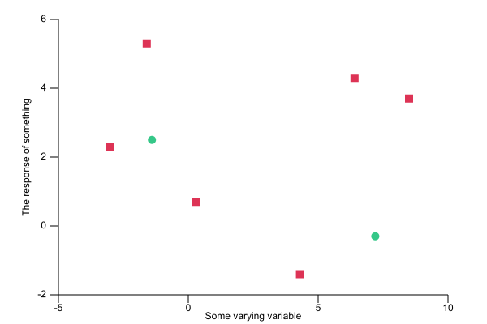

# plotlib


[](https://codecov.io/gh/milliams/plotlib)
[](https://crates.io/crates/plotlib)

[](https://docs.rs/plotlib)

`plotlib` is a generic data visualisation and plotting library for Rust.
It is currently in the very early stages of development.

It can currently produce:

* histograms
* scatter plots
* line graphs from data or from function definitions
* box plots
* bar charts

rendering them as either SVG or plain text.

The API is still very much in flux and is subject to change.

For example, code like:

```rust
use plotlib::page::Page;
use plotlib::repr::Plot;
use plotlib::view::ContinuousView;
use plotlib::style::{PointMarker, PointStyle};

fn main() {
    // Scatter plots expect a list of pairs
    let data1 = vec![
        (-3.0, 2.3),
        (-1.6, 5.3),
        (0.3, 0.7),
        (4.3, -1.4),
        (6.4, 4.3),
        (8.5, 3.7),
    ];

    // We create our scatter plot from the data
    let s1: Plot = Plot::new(data1).point_style(
        PointStyle::new()
            .marker(PointMarker::Square) // setting the marker to be a square
            .colour("#DD3355"),
    ); // and a custom colour

    // We can plot multiple data sets in the same view
    let data2 = vec![(-1.4, 2.5), (7.2, -0.3)];
    let s2: Plot = Plot::new(data2).point_style(
        PointStyle::new() // uses the default marker
            .colour("#35C788"),
    ); // and a different colour

    // The 'view' describes what set of data is drawn
    let v = ContinuousView::new()
        .add(s1)
        .add(s2)
        .x_range(-5., 10.)
        .y_range(-2., 6.)
        .x_label("Some varying variable")
        .y_label("The response of something");

    // A page with a single view is then saved to an SVG file
    Page::single(&v).save("scatter.svg").unwrap();
}

```

will produce output like:


